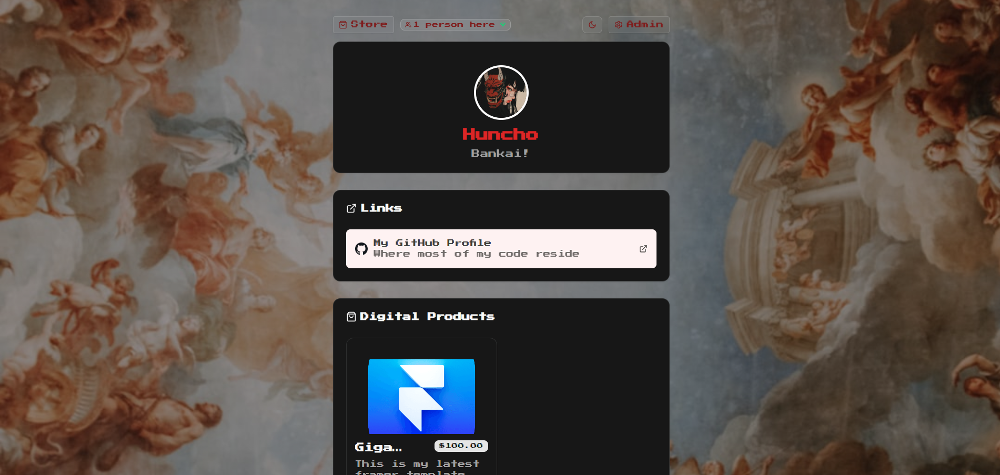

# `shelf🔗⚡`

**Transforming a static page into a dynamic experience**



## Table of Contents

| Section                                   | Description                                        |
| ----------------------------------------- | -------------------------------------------------- |
| [Introduction](#introduction)             | Brief overview of what the project does            |
| [Features](#features)                     | Highlight key functionalities                      |
| [Local Development](#local-development)   | How to install and run the project                 |
| [Hackathon Criteria](#hackathon-criteria) | How my project fits in with the hackathon criteria |
| [Contributing](#contributing)             | How others can help with development               |
| [License](#license)                       | Licensing information                              |

## Introduction

`Shelf` is an open-source alternative to Linktree - simple, fast, themeable and fully yours.
Most existing open-source link-in-bio solutions feel outdated or lack key features, like analytics, guestbook signing etc (most proproietary ones even lack this) leaving creators stuck with closed platforms. Shelf changes that by offering a modern, lightweight, and customizable solution you can self-host, extend, and truly own.

## Features

- `🔗Links`

  - Create, update, delete, and reorder links (drag-and-drop)
  - Click tracking and analytics
  - Link scheduling for time-limited promotions

- `🏪Digital Store`

  - Create and manage digital downloadable products
  - Upload files and cover images to Encore storage
  - Support for free (price $0) and paid products ($1+)
  - Stripe Checkout integration for paid items
  - Instant downloads for free products
  - Secure download links after purchase

- `📔Guestbook`

  - Public submissions with moderation
  - Export entries as JSON or CSV

- `⚙️Site Settings`
  - Title, description, avatar URL
  - Theme presets and custom colors
  - Unsplash integration for backgrounds

<!-- - `Custom Domains`
  - Connect your own domain name
  - Automatic DNS verification
  - Step-by-step setup instructions
  - SSL certificate provisioning -->

- `🔏Admin`

  - Password-protected admin dashboard
  - No third-party auth required

- `🩺Analytics`
  - Live visitor count
  - Total link clicks
  - Total guest messages and pending moderation count
  - Product sales and revenue
  - Top performing links
  - Recent guestbook activity
  - Visitor analytics with device and location breakdown
  - Link-specific heatmaps and click patterns

## Local Development

### 1. Prerequisites

- Download and install Encore at [Encore](https://encore.dev)
- Download and install Bun at [Bun](https://bun.sh)
- Download and install Stripe CLI for your platform [Stripe CLI](https://docs.stripe.com/stripe-cli/install)
- Download and install Docker Desktop at [Docker](https://www.docker.com/)

### 2. Cloning & Installation

```bash
# Clone the repo
git clone https://github.com/lucky-chap/shelf.git

# Navigate into project
cd shelf

# Install dependencies
bun install
```

### 3. Encore CLI Login

- After installing the Encore CLI, open up a terminal and type `encore auth login` to login

### 4. Stripe CLI Login

- After extracting the Stripe CLI, add it to your PATH
- Open up a terminal and type `stripe login` to login
- After logging in, type `stripe listen` to listen for Stripe
  Events in the app
- Copy your `webhook secret` that appears and populate
  as shown below

### 5. Environment Variables

#### Backend Variables

`cd` into the `backend` folder and do these:

```bash
encore secrets set --type local,dev,pr,prod STRIPE_SECRET_KEY
```

```bash
encore secrets set --type local,dev,pr,prod STRIPE_WEBHOOK_SECRET
```

```bash
encore secrets set --type local,dev,pr,prod STRIPE_PUBLISHABLE_KEY
```

```bash
encore secrets set --type local,dev,pr,prod UNSPLASH_ACCESS_KEY
```

#### Frontend Variables

There are no frontend variables used in this project

### 6. Running the app

`cd` into the `frontend` folder and run this
in your terminal

```bash
npx vite dev
```

`cd` into the `backend` folder and run this
in your terminal

```bash
encore run
```

## Hackathon Criteria

### 🔨 Impact

Most link-in-bio tools lock essential features behind subscriptions.
This project solves vendor lock-in by giving creators, NGOs, and communities an open, free, self-hosted platform with all the tools they need:

- Links + Store + Guestbook + Analytics in one place
- Data ownership and no hidden fees
- Accessible to anyone from influencers to non-profits
- No extra fees paid for your own content
- Foster community with Guestbook

### ✏️ Execution

- Drag-and-drop links and products with live previews for smooth UX
- Fast and reliable backend with database migrations
- Secure Stripe integration for payments

### ⚡ Innovation

- First open-source tool combining links, store, guestbook, and advanced analytics
- Live visitor count. Creates a sense of urgency and excitement which is perfect for product drops, campaigns, or timed promotions.
- Unique guestbook feature turns static bios into interactive community hubs
- Creative monetization via digital downloads directly on your page
- Modular architecture (links, products, guestbook, analytics) for easy extension

### 💯 Completeness

- Functional demo with links, products, guestbook, and analytics (only for hackathon judges)
- Clear documentation for easy set-up
- Password-protected admin, no third-party login needed
- Organized project structure with /frontend, /backend

## Contributing

- Fork this repository;
- Create your branch: git checkout -b my-new-feature;
- Commit your changes: git commit -m 'Add some feature';
- Push to the branch: git push origin my-new-feature.

After your pull request is merged, you can safely delete your branch.

## License

This project is licensed under the MIT License - see the [LICENSE](./LICENSE) file for more information.

## More

You can also check out [DEVELOPMENT.md](./DEVELOPMENT.md) for more details on how to run
